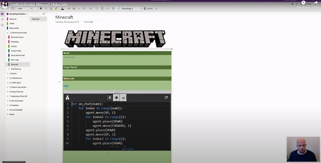

Editors: 
[ ] change the date and title above
[ ] Top Link Last Month

Template Updated 5/14/20 by Anne

## The MakeCode Newsletter

This is a newsletter devoted to Microsoft MakeCode, the easy but powerful block and Javascript code creator. We include MakeCode news, highlights, information, happenings, hardware, and more from around the globe. (Incidentally, if you catch wind of anybody using MakeCode beyond this, our Earth, please let us know about it!)

If you'd like to receive this newsletter via email early each month, [sign up here](https://www.adafruitdaily.com/).

Missed a previous issue? No worries, you can check out the archive [right here](http://makecode.adafruitdaily.com/)!

## Feature Story!

placeholder text.

## Education Spotlight

The Microsoft Build conference talk: Inspiring Next Gen Coders with MakeCode - [Microsoft](https://mybuild.microsoft.com/sessions/d45b7310-bd32-4598-b2a3-be47e8a0d2e4).

Microsoft and GitHub announce that they are making online integrated development environments (IDEs) such that students can get right to work in a web browser, avoiding software conflicts that might happen with code installs on their local machines.

Code on a laptop or with a tablet—students won’t be slowed down by their devices. Students can get started quickly in the same coding environment, so educators may teach instead of troubleshooting.

Currently integration includes MakeCode Arcade - [GitHub](https://github.blog/2020-05-26-code-in-the-browser-with-github-classroom/).

Displaying your students MakeCode in OneNote has never been easier. Learn how to take coding from Minecraft and embed it into your OneNote - [Twitter](https://twitter.com/digitalrichards/status/1268346023505625093?s=20) and [YouTube](https://youtu.be/mp3e7gfV6YU).

## Microsoft MakeCode Live Streaming and Resources for Students and Educators

The MakeCode team posts "To help families affected by school closures, the Microsoft MakeCode team will start live streaming coding lessons next for micro:bit, MakeCode Arcade and Minecraft. They are also providing online tutorials and project along with educator resources. See the [MakeCode Online Learning page](https://makecode.com/online-learning) to see all these resources and for the latest streaming schedule. - [Twitter](https://twitter.com/MSMakeCode/status/1238534099792359424)

The Microsoft MakeCode YouTube Channel has recordings of livestreams - [YouTube](https://www.youtube.com/channel/UCye7YlvFUUQ1dSy0WZZ1T_Q/videos?view=2&flow=grid)

Code your own game with Davon Godchaux of the Miami Dolphins - [Mixer](https://mixer.com/MakeCode?vod=sLOPjdnA6UOiCz5PLxXFsQ)

MakeCode in the Kitchen series from Microsoft for kids at home - [Mixer - last week](https://mixer.com/MakeCode?vod=pk_GidwN80GyX9vmMQlZfw) and [YouTube Playlist](https://www.youtube.com/watch?v=Q_wt7VoApFY&list=PLMMBk9hE-SerWvHZva9o9RFpGk2aY6d40)

## MakeCode Minute

placeholder text.

Check out all the MakeCode minute [videos on YouTube](https://www.youtube.com/playlist?list=PLjF7R1fz_OOU5gFO10qxLlbtN0YzZTyvk).

## MakeCode Arcade Game of the Week!

placeholder text.

Check out all the MakeCode Arcade game of the week [videos on YouTube](https://www.youtube.com/playlist?list=PLjF7R1fz_OOUpC_QY_Y5CmPKm-a5Cg4Qo).

## News from around the web!

[title](url)

Using Bluetooth to talk between a micro:bit and CLUE board in MakeCode and CircuitPython respectively - [Twitter](https://twitter.com/PlusPlusInt/status/1263835321319464960), [CircuitPython Code](https://drive.google.com/file/d/11VC9ARay88x7QFD1vQ5pbqDHNuNcoAaf/view) and [MakeCode](https://makecode.microbit.org/24284-48283-61869-95629).

Waris Candra posts: "Starting our “new normal (with distancing/masks/sanitizer, et cetera). Feeling Energised with micro:bit, code.org, and MakeCode on a thunderstorm/Red Rain & Alert Saturday 9.30am! Amazing commitment from parents and students!" - [Twitter](https://twitter.com/wariscandra/status/1266609048641658880?s=09).

Getting a Circuit Playground Express from Adafruit for my 10 year olds birthday. Within 5 minutes of him opening it (he was) using MakeCode to create his own program! "I made that! It's really easy for coding actually." - [Twitter](https://twitter.com/_cd83/status/1266068369318576130).

Ivan posts: "Thinking outside the box in MakeCode for micro:bit. My son is too young for MakeCode so I made him [this simple coding project](https://makecode.microbit.org/_Ec80u2hPoM7T). Unicode emoji characters are an excellent way to simplify content for younger audiences" - [Twitter](https://twitter.com/PlusPlusInt/status/1267851737395875840).

Make your own programmable processor (CPU) with a micro:bit and MakeCode - [BlogMyWiki](http://www.suppertime.co.uk/blogmywiki/2020/05/microbit-cpu/).

#ICYDNCI What was the most popular, most clicked link, in [last month's newsletter](http://makecode.adafruitdaily.com/monthly/2020/05/12/arcade-mini-game-in-a-text-adventure.html)? [Careers at Microsoft](https://careers.microsoft.com/us/en/search-results?keywords=MakeCode).

## Microsoft is hiring for the MakeCode Team

Microsoft is a major employer and recently announced they have openings in the MakeCode Team. See their [Job Listings](https://careers.microsoft.com/us/en/search-results?keywords=MakeCode) for the positions open - [Twitter](https://twitter.com/MSMakeCode/status/1250485247600287744).

## Coming Soon

Beta testing helps us improve micro:bit by trying out new software before it's more widely released. Become a micro:bit beta tester and try out the latest MakeCode before it's released - [Twitter](https://twitter.com/microbit_edu/status/1266667667915591680) and [microbit](https://microbit.org/beta-testing/).

## New Guides using MakeCode!

[title](url) from [name](url).

And check out all [MakeCode guides on learn.adafruit.com](https://learn.adafruit.com/search?q=makecode).

## New Extensions!

placeholder text.

## New Hardware!

GameGo - a handheld console with which one can code their own games with MakeCode - [TinkerGen](https://shop.tinkergen.com/gamego.html).

The GiggleBot is a robot powered by the micro:bit that is for the classroom, makerspace, or a remote learning environment. The GiggleBot can be programmed using Microsoft’s MakeCode environment, which is the primary platform for the micro:bit. This provides a platform for block coding as well as Javascript and the GiggleBot can also be programmed in Python! - [Eduporium](https://www.eduporium.com/store/blog/eduporium-experiment-gigglebot/) and [YouTube](https://youtu.be/rLuS1BsOelA).

Brown Dog Gadgets announces "Another test of our prototype Crazy Circuits micro:bit board. We built a relay into it for controlling simple DC motors and objects. You might say we’re big fans of relays." - [Twitter](https://twitter.com/BrownDogGadgets/status/1263857358381502465?s=20).

## Upcoming Events!

placeholder text.

## Latest Releases

placeholder text.

## Resources for Educators and more!

If we missed any resources, please let us know on [GitHub](https://github.com/adafruit/makecode-newsletter/issues), we’ll be updating this list each newsletter.

* [MakeCode](https://www.microsoft.com/en-us/makecode/)
* [MakeCode forums](https://forum.makecode.com/)
* [MakeCode Blog](https://makecode.com/blog)
* [Awesome MakeCode on GitHub](https://github.com/adafruit/awesome-makecode/blob/master/README.md)
* [r/MakeCode - Reddit](https://www.reddit.com/r/MakeCode/)
* [@MSMakeCode on Twitter](https://twitter.com/MSMakeCode)
* [Latest #MakeCode tagged Tweets](https://twitter.com/search?q=%23makecode&src=typed_query&f=live)
* [MakeCode on Instagram](https://www.instagram.com/makecode/)
* [#MakeCode tagged photos on Instagram](https://www.instagram.com/explore/tags/makecode/)
* [MakeCode on YouTube](https://www.youtube.com/channel/UCye7YlvFUUQ1dSy0WZZ1T_Q)
* [MakeCode minute on YouTube](https://www.youtube.com/playlist?list=PLjF7R1fz_OOU5gFO10qxLlbtN0YzZTyvk)
* [MakeCode Arcade Game of the Week on YouTube](https://www.youtube.com/playlist?list=PLjF7R1fz_OOUpC_QY_Y5CmPKm-a5Cg4Qo)
* [MakeCode posts on Adafruit](https://blog.adafruit.com/category/makecode/)
* [MakeCode guides on learn.adafruit.com](https://learn.adafruit.com/search?q=makecode)

## Join the MakeCode Discussions on Discord

The Adafruit Discord community has a dedicated #makecode channel to discuss all things MakeCode, seek advice, etc. - [Join us now](https://discord.gg/XPa7R6).

## What is Microsoft MakeCode?

Microsoft MakeCode is a free, open source platform for creating engaging computer science learning experiences that support a progression path into real-world programming - [YouTube](https://www.youtube.com/watch?v=ZegjmbyBUs8).

**Simulator**

An interactive simulator provides students with immediate feedback on how their program is running and makes it easy to test and debug their code.

**Block Editor**

Students new to coding can start with colored blocks that they can drag and drop onto their workspace to construct their programs.

**JavaScript Editor**

When they are ready, students can move into a full-featured JavaScript editor with code snippets, tooltips, and error detection to help them.

## MakeCode Arcade

Microsoft MakeCode Arcade is a web-based beginner-friendly code editor to create retro arcade games for the web and for microcontrollers. In this guide, you will learn how to assemble your own Arcade hardware from different parts. MakeCode Arcade is open source, and on [GitHub](https://github.com/microsoft/pxt-arcade).

Microsoft has produced an excellent overview video of MakeCode Arcade - [YouTube](https://www.youtube.com/watch?v=UCq1VUIqpHI).

## Contribute!

The MakeCode Newsletter is a community-run newsletter with support from Microsoft. The complete [archives are here](https://www.adafruitdaily.com/category/makecode/). Contributions are welcome! Please make pull request to modify the latest draft from inside the `_drafts` directory on [GitHub](https://github.com/adafruit/makecode-newsletter/tree/master/_drafts).

