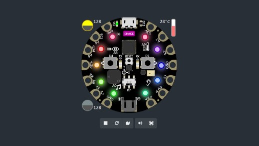
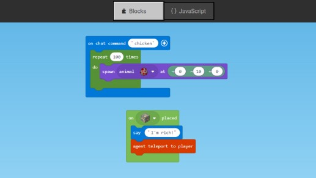
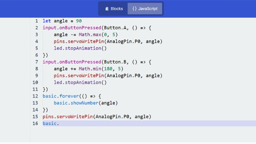

## The MakeCode Newsletter
A newsletter devoted to Microsoft MakeCode. News, information, happenings, etc. Content for the MakeCode newsletter. Emailed out each month. Sign up [here](https://www.adafruitdaily.com/).

Feature story text here

change date

update title

## Feature story!

placeholder text.

## Educator spotlight

placeholder text.

## MakeCode minute

placeholder text.

Check out all the MakeCode minute [videos on YouTube](https://www.youtube.com/playlist?list=PLjF7R1fz_OOU5gFO10qxLlbtN0YzZTyvk).

## MakeCode Arcade Game of the week!

placeholder text.

Check out all the MakeCode Arcade game of the week [videos on YouTube](TBD-JP).

## News from around the web!

[title](url)

#ICYDNCI What was the most popular, most clicked link, in [last week's newsletter](https://link)?

## Coming soon

placeholder text.

## New guides using MakeCode!

[title](url) from [name](url).

## New Extensions!

placeholder text.

## Upcoming events!

placeholder text.

## Latest releases

placeholder text.

## NUMBER thanks!

The Adafruit Discord community, where we do all our MakeCode development in the open, reached over NUMBER humans, thank you! Join today! [https://adafru.it/discord](https://adafru.it/discord)

## Resouces for educators and more!

placeholder text.

* [MakeCode](https://www.microsoft.com/en-us/makecode/)
* [MakeCode forums](https://forum.makecode.com/)
* [MakeCode Blog](https://makecode.com/blog)
* [Awesome MakeCode on GitHub](https://github.com/adafruit/awesome-makecode/blob/master/README.md)
* [r/MakeCode - Reddit](https://www.reddit.com/r/MakeCode/)
* [@MSMakeCode on Twitter](https://twitter.com/MSMakeCode)
* [MakeCode on Instagram](https://www.instagram.com/makecode/)
* [MakeCode on YouTube](https://www.youtube.com/channel/UCye7YlvFUUQ1dSy0WZZ1T_Q)

## What is Microsoft MakeCode?
Microsoft MakeCode is a free, open source platform for creating engaging computer science learning experiences that support a progression path into real-world programming.

**Simulator**

An interactive simulator provides students with immediate feedback on how their program is running and makes it easy to test and debug their code.

**Block Editor**

Students new to coding can start with colored blocks that they can drag and drop onto their workspace to construct their programs.

**JavaScript Editor**

When they are ready, students can move into a full-featured JavaScript editor with code snippets, tooltips, and error detection to help them.

## MakeCode Arcade

Microsoft MakeCode Arcade is a web-based beginner-friendly code editor to create retro arcade games for the web and for microcontrollers. In this guide, you will learn how to assemble your own Arcade hardware from different parts. MakeCode Arcade is open source, and on [GitHub](https://github.com/microsoft/pxt-arcade).

## Contribute!

The MakeCode Newsletter is a community-run newsletter with support from Microsoft. The complete [archives are here](https://www.adafruitdaily.com/category/makecode/).

