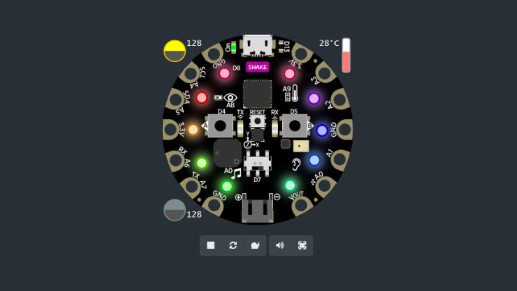
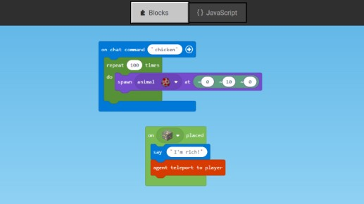
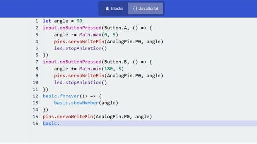

## What is Microsoft MakeCode?
Microsoft MakeCode is a free, open source platform for creating engaging computer science learning experiences that support a progression path into real-world programming.

**Simulator**

An interactive simulator provides students with immediate feedback on how their program is running and makes it easy to test and debug their code.

**Block Editor**

Students new to coding can start with colored blocks that they can drag and drop onto their workspace to construct their programs.

**JavaScript Editor**

When they are ready, students can move into a full-featured JavaScript editor with code snippets, tooltips, and error detection to help them.
